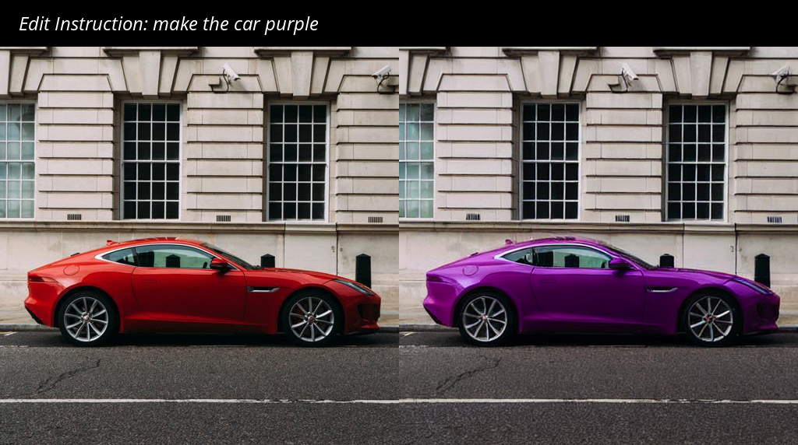
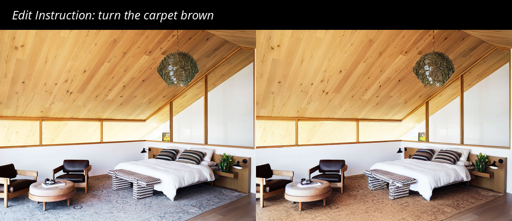

# Grounded-Instruct-Pix2Pix: Improving Instruction Based Image Editing with Automatic Target Grounding


---
Artur Shagidanov*, Hayk Poghosyan*, Xinyu Gong*, Zhangyang Wang, Shant Navasardyan, Humphrey Shi


## About Grounded-Instruct-Pix2Pix

---


We present Grounded-Instruct-Pix2Pix a robust framework designed for localized instruction-based image editing.
It consists of 2 stages: 1) grounding mask extraction and 2) localized image editing.
Grounding mask extraction step aims to detect the area-of-interest to which the editing process should be confined based on the user-provided editing instruction.
At the core of it lies a novel CLIP-Score Filtering pipeline, which extracts the key noun-phrase from the instruction that points to the correct editing targets in the image.
The extracted noun-phrase is the fed to [Grounded-SAM](https://github.com/IDEA-Research/GroundingDINO) segmentation model, which outputs the final grounding mask.
then, localized image editing step performs the actual image editing, using the grounding mask extracted during the previous step.
It employs a state-of-the-art image editor [Instruct-Pix2Pix](https://github.com/timothybrooks/instruct-pix2pix), which is modified to utilize the latent blending technique proposed in [Blended Latent Diffusion](https://github.com/omriav/blended-latent-diffusion).
The goal of latent blending is to restore the areas of the image that the user wishes to preserve.
It is employed only during the last ~10% of the denoising steps, to allow Instuct-Pix2Pix to perform the bulk of the editing before restoring the non-edit areas.
Our method incurs little overhead and does not require any additional inputs from the user.
Please refer to the figure above for the detailed pipeline.


## Installation

---

We provide a ```requirements.txt``` that contains most of the dependencies needed. To install them just run:

```
pip install -r requirements.txt
```

You will need to download the NLP model separately with:

```
python -m spacy download en_core_web_sm
```

Lastly, to install GroundingDINO:

```
export CUDA_HOME=/path/to/your/cuda/installation

git clone https://github.com/IDEA-Research/GroundingDINO.git
cd GroundingDINO
python setup.py install

mkdir weights
cd weights
wget https://github.com/IDEA-Research/GroundingDINO/releases/download/v0.1.0-alpha/groundingdino_swint_ogc.pth
cd ../../
```

Please refer to [GroundingDINO](https://github.com/IDEA-Research/GroundingDINO) if you encounter difficulties.

\
To run our model we provide a jupyter notebook:
```
grounded-instruct-pix2pix.ipynb
```


## Tips and Examples

---

Complementary to the paper, we present additional editing examples.
But unlike in the paper, here we also experiment with different hyperparameters.
Because our method recovers the background during the late stages of denoising,
we are free to use higher text-guidance or lower image-guidance scales.
For reference the default hyperparameters are:

```
image_guidance_scale = 1.5
text_guidance_scale  = 7.5

# here, steps are defined w.r.t. num_train_steps(=1000)
start_blending_at_tstep = 100
end_blending_at_tstep   = 1
```


### Examples with default hyperparameters.




### Examples with different guidance scales.

Here, to get a better looking edit, we set the ```image_guidance_scale = 1.25```.


We used ```image_guidance_scale = 1.0``` to best match the color of the carpet to the overall color palette of the room.


### About the Inversion Range

Even though latent blending rarely leaves blending artifacts, you may still encounter them from time to time.
In case of this edit, we remove the blending artifacts that were present around the right hand in the edited image 
by shifting the latent blending interval towards earlier denoising steps:

```
text_guidance_scale     = 5.0
start_blending_at_tstep = 300
end_blending_at_tstep   = 200
```


